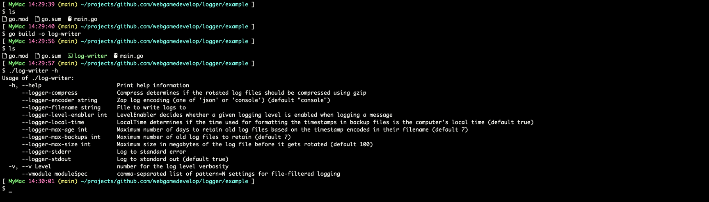
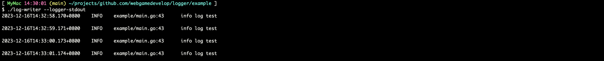
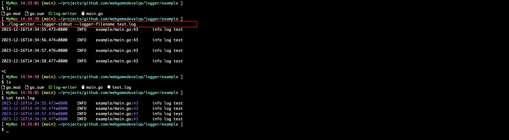
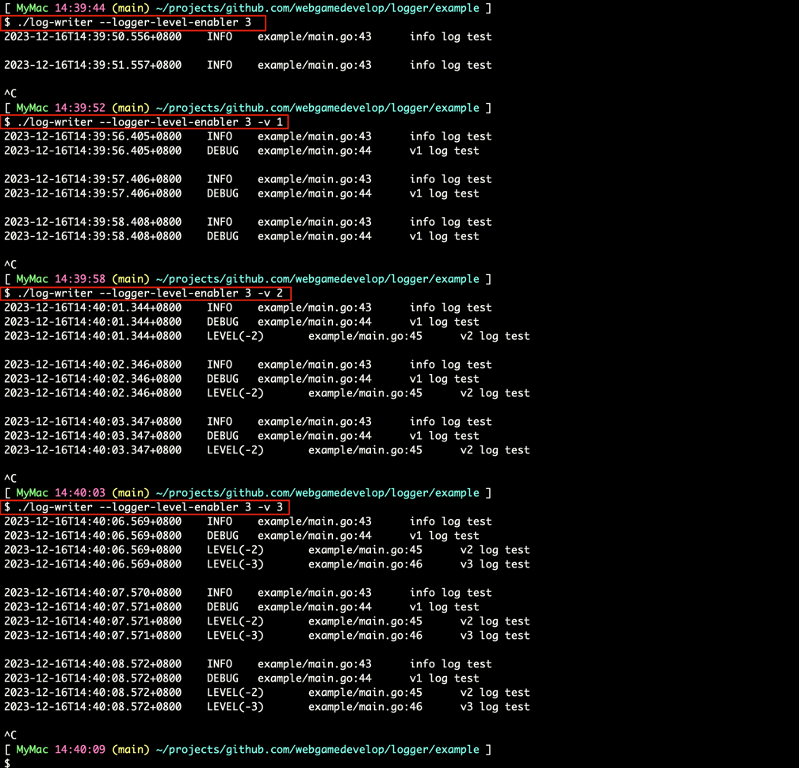
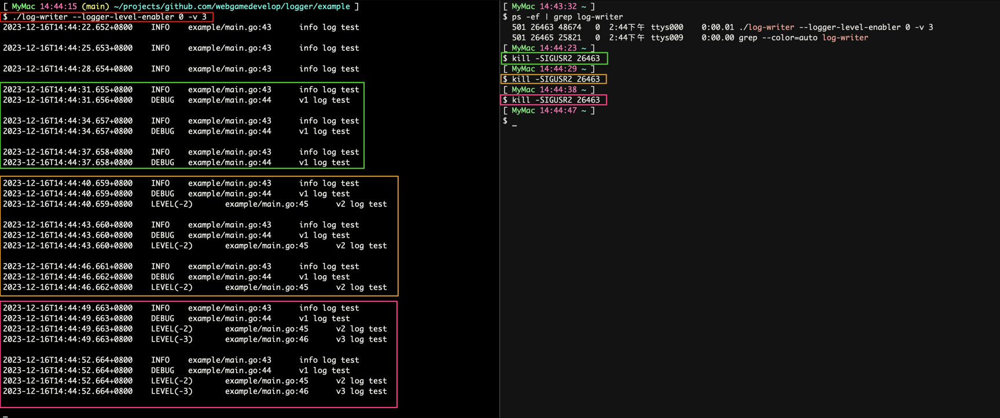

# logger

logger 是一个日志配置库，通过简单的函数完成 `uber-go/zap` 的配置
* 动态调整日志级别
* 支持同时写入`文件`和 stdout/stderr
* 支持日志文件 rotate
* 同时支持使用 API 和命令行参数调整日志配置

## example
```go
package main

import (
	"context"
	"flag"
	"fmt"
	"time"

	"github.com/spf13/pflag"
	"k8s.io/klog/v2"

	"github.com/webgamedevelop/logger"
)

func main() {
	ctx, cancel := context.WithCancel(context.Background())
	defer cancel()

	var filteredKlogFlags flag.FlagSet

	// init klog flags
	FilterFlags(&filteredKlogFlags)

	// init logger flags
	logger.InitFlags(&filteredKlogFlags)

	pflag.CommandLine.AddGoFlagSet(&filteredKlogFlags)
	pflag.BoolP("help", "h", false, "Print help information")
	pflag.Parse()
	if pflag.CommandLine.Changed("help") {
		pflag.Usage()
		return
	}

	logrLogger, flush := logger.New(ctx, logger.DefaultEncoderConfig)
	klog.SetLoggerWithOptions(logrLogger, klog.FlushLogger(flush))
	defer klog.Flush()

	// 启动时指定命令行参数 -v=3
	// 通过 `kill -SIGUSR1 $PID` 减少日志输出
	// 通过 `kill -SIGUSR2 $PID` 打印更详细信息
	for {
		klog.Info("info log test")
		klog.V(1).Info("v1 log test")
		klog.V(2).Info("v2 log test")
		klog.V(3).Info("v3 log test")
		fmt.Println()
		time.Sleep(time.Second)
	}
}

func FilterFlags(fs *flag.FlagSet) {
	var allFlags flag.FlagSet
	klog.InitFlags(&allFlags)
	if fs == nil {
		fs = flag.CommandLine
	}
	allFlags.VisitAll(func(f *flag.Flag) {
		switch f.Name {
		case "v", "vmodule":
			fs.Var(f.Value, f.Name, f.Usage)
		}
	})
}
```
### 编译

### 将日志写入 stdout

### 将日志同时写入文件和 stdout

### 调整日志级别

### 调整运行中的进程的日志级别

